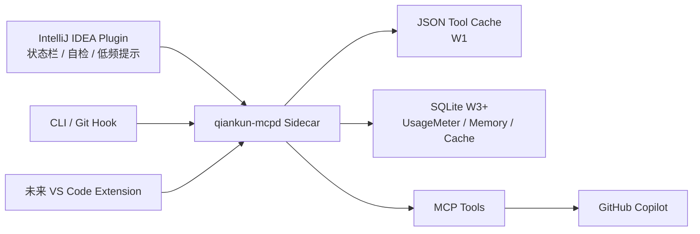

# QianKun / 乾坤袋

乾坤袋是面向 GitHub Copilot 与 AI 编程助手的本地上下文治理层。它不替代 Copilot，不自建完整 AI runtime，而是在 Copilot 外侧提供缓存、压缩、Memory Index、指令治理和 UsageMeter，让开发者尽量保持原有使用习惯，同时让组织看清 token 成本、缓存命中和节省效果。

本文基于 Notion 文档《乾坤袋 · 中文友好精简版（背景 · 原理 · 开发方案）》及其子文档整理。当前仓库如尚未包含对应代码目录，请把本文视为工程落地说明和验收口径。

## 为什么做

GitHub 官方文档说明：从 2026-06-01 起，Copilot 将从 request-based billing 迁移到 usage-based billing，Copilot 交互会按 input tokens、output tokens、cached tokens 等消耗折算为 GitHub AI Credits。项目文档中的成本假设已与 GitHub Docs / GitHub Blog 的公开说明一致。

当前 AI IDE / Copilot 工作流的主要问题：

- 上下文过载：整仓扫描、整文件粘贴、lockfile、历史文档、AI 工具缓存和构建产物挤占真正有用的业务源码上下文。
- 重复上下文浪费：仓库结构、工具结果、扫描摘要和长 instructions 在多轮会话中反复进入上下文。
- 召回不稳定：简单文件扫描不能理解 Vue、Angular、React、Spring Boot 等项目结构，容易把文档、配置或锁文件排到业务文件前面。
- 指令不可观测：`AGENTS.md`、`CLAUDE.md`、Copilot instructions、README、技能文档可能重复、过长、缺少作用域或混入动态信息。
- 节省效果不可验证：只说“节省 token”不够，需要 UsageMeter 能解释节省、缓存、开销和净收益。

## 产品目标

对普通开发者：继续正常使用 Copilot，只是更少粘贴、更少等待、更少被无关上下文误导。

对组织管理者：看得见用量、解释得清节省、管得住高风险和高成本场景。

目标指标：

| 指标 | 目标 |
| --- | --- |
| 组织月 token 节省 | 基础 >= 30%，目标 45% |
| Phase 1 灯塔用户节省 | >= 20% |
| 乾坤袋自身消耗 | <= 节省的 5% |
| 首次安装到可用 | <= 5 分钟 |
| 每日主动打扰 | <= 2 次 / 人 / 天 |

## 总体架构

乾坤袋采用 Thin Plugin + Sidecar 的形态：

- JetBrains / IntelliJ IDEA 插件优先：状态栏、自检入口、安装引导、低频提示、个人看板入口。
- 本地 sidecar `qiankun-mcpd` 承载核心逻辑：Memory Index、UsageMeter、tool cache、payload minimizer、instructions lint、health check。
- W1 的 Tool Result Cache 首版使用 in-memory + JSON 文件持久化；SQLite 仍保留给后续 UsageMeter / Memory / Cache 演进。
- MCP 只暴露最小工具集，避免工具描述和工具返回成为新的 token 黑洞。
- VS Code Extension 与 CLI 作为后续入口复用同一个 sidecar。



五个核心能力面：

| 能力面 | 作用 | 关键模块 |
| --- | --- | --- |
| Memory & Cache | 减少重复扫描和重复上下文 | Memory Index、Tool Result Cache、C1/C2/C3、C4、C5 |
| Instructions | 给项目规则减肥并检查风险 | InstructionsLinter、路径级 instructions、重复检测 |
| MCP Tools | 控制工具数量、描述和返回体积 | usage-report、config-query、protocol-probe、payload minimizer |
| Skills & Chat Modes | 只在高收益场景轻提示 | PromptLint、ScopeClarifier、WorkspaceIndexHinter、PlanGuard |
| UsageMeter | 证明是否真的节省 | token 估算、cacheable ratio、saved vs overhead、weekly report |

## 工程结构

```text
.
├── cmd/
│   └── qiankun-mcpd/
│       └── main.go
├── internal/
├── idea-plugin/
├── scripts/
├── testdata/
├── Makefile
├── README.md
└── AGENTS.md
```

当前 W2 已在 W1 的 `internal/toolcache` 和 `internal/injection` 基础上新增 `internal/memory/scan`、`internal/memory/tokens`，并保留 `internal/compaction` 占位包。`internal/instructions`、`internal/usage`、`internal/weekly`、SQLite Memory Index、MCP server 等仍会在后续 W3+ 按阶段新增。

CLI 状态：

| 命令 | 用途 | 当前状态 |
| --- | --- | --- |
| `qiankun-mcpd --version` | 输出 sidecar 当前版本 | W2 已实现，当前版本 `0.2.0-w2` |
| `qiankun-mcpd --health` | 输出 sidecar readiness | W1 已扩展，顶层 `status` 保持 `ready`，新增 `toolcache` 子对象 |
| `qiankun-mcpd memory-scan --root <path> --format json` | 扫描仓库，输出文件分档、权重、token 估算和 skipped summary | W2 已实现；不含 SQLite FTS5 和查询 |
| `qiankun-mcpd memory-query --root <path> --query "<text>" --top-k 8` | 查询相关文件上下文 | W3+ 目标，未实现 |
| `qiankun-mcpd usage-report` | 输出本地 UsageMeter 汇总 | W3+ 目标，未实现 |
| `qiankun-mcpd weekly-report --format markdown` | 输出 token、cache、Memory、Instructions 周报 | W3+ 目标，未实现 |

安装命令：

```bash
go install github.com/xiaoboxuezhangora/QianKun/cmd/qiankun-mcpd@latest
```

该命令要求远端 GitHub 仓库路径与 `go.mod` 的 module path 保持一致，即 `github.com/xiaoboxuezhangora/QianKun`。

目标验证命令：

```bash
make smoke
go test ./...
make idea-plugin
```

## 当前阶段判断

当前仓库处于 **Phase W2 / 分档压缩与扫描器已落地** 状态。W2 只实现仓库扫描、文件分档、权重、文本 token 粗估、跳过原因解释和 `memory-scan` JSON 输出；`internal/compaction` 只是占位文档，不介入长会话流。本仓库当前不能宣称具备 SQLite FTS5 Memory Index、`memory-query`、UsageMeter、weekly-report、IDEA 插件真实逻辑或 MCP server。

W1 已落地：

- Go module：`github.com/xiaoboxuezhangora/QianKun`。
- 目录骨架：`cmd/qiankun-mcpd/`、`internal/`、`idea-plugin/`、`scripts/`、`testdata/`。
- `internal/toolcache` 提供线程安全 KV store，支持 in-memory + JSON 文件持久化、TTL 过期、LRU 容量驱逐、Stats 和 Close。
- Toolcache key 格式为 `<tool>:<arg-hash>:<schema-ver>`，参数 hash 基于 JSON 稳定序列化，schema version 为空时使用默认 `v1`。
- `internal/injection` 支持解析 `<!-- QIANKUN:START -->` / `<!-- QIANKUN:END -->` C1 注入区，并提供项目根目录 `AGENTS.md` / `CLAUDE.md` 的文件级读取入口。
- `docs/spec/c1-injection-zone.md` 记录注入区协议、幂等原则、错误处理和 W1 非目标。
- `qiankun-mcpd --version` 输出 `0.2.0-w2`。
- `qiankun-mcpd --health` 输出稳定 JSON，顶层保留 `{"status":"ready"}` 语义，并新增 `toolcache` 子对象。
- 未识别参数返回非 0，并输出简短 usage。
- `scripts/bootstrap.sh` 可重复创建 `~/.qiankun/bin`、`~/.qiankun/cache`、`~/.qiankun/db`、`~/.qiankun/logs`。
- `make idea-plugin` 仍为占位，输出 `IDEA plugin not implemented yet`，退出码为 0。

W2 已落地：

- `internal/memory/tokens` 提供 `EstimateTextTokens`，对英文、中文/日韩、混合文本和空文本做保守估算。
- `internal/memory/scan` 提供标准库仓库遍历 Walker，输出相对路径、文件分档、权重、token 估算、跳过状态和跳过原因。
- 默认跳过高噪声目录：`node_modules`、`dist`、`build`、`target`、`coverage`、`.git`、`.idea`、`.gradle`、`tmp`、`logs`。
- 默认识别并跳过 lockfile：`*.lock`、`pnpm-lock.yaml`、`package-lock.json`、`yarn.lock`。
- 默认识别并跳过 AI 工具缓存/历史：`.claude/settings.local.json`、`.opencode/skills/**`、`.ai-docs/**`。
- 对超过 64KB 的文本文件只读取尾部 8KB 作为 sample；二进制按扩展名或 NUL sample 识别后不进入索引。
- 支持 `--include` / `--exclude` 基础 glob 过滤，为后续规则演进保留兼容入口。
- `skipped_summary` 按原因聚合数量，并保留最多 3 个代表路径。
- 对 `android/**` 下 Gradle、Manifest 和配置类文件做低权重保守索引，避免误跳过 Capacitor / Android 关键配置；W2 不做完整 Android / Capacitor 语义召回。
- 轻量支持根目录 `.gitignore` 和 `.contextgateignore`：支持注释、空行、目录规则、基础 glob 和 `**`；暂不支持 `!` 反选和完整 Git ignore 语义。
- `internal/compaction` 仅是占位 package，明确 W2 不做真实会话压缩。

W2 使用示例：

```bash
./bin/qiankun-mcpd memory-scan --root testdata/memory-scan-fixture --format json
./bin/qiankun-mcpd memory-scan testdata/memory-scan-fixture
./bin/qiankun-mcpd memory-scan --root . --format json --include 'src/**' --exclude 'dist/**'
```

W2 JSON 输出结构：

```json
{
  "root": "/absolute/project",
  "generated_at": "2026-05-28T00:00:00Z",
  "totals": {
    "files_seen": 8,
    "files_indexed": 4,
    "files_skipped": 4,
    "directories_skipped": 3,
    "estimated_tokens": 123
  },
  "skipped_summary": {
    "build_artifact": {
      "count": 1,
      "representative_paths": ["dist"]
    }
  },
  "files": [
    {
      "path": "src/main.ts",
      "size_bytes": 96,
      "kind": "source",
      "weight": 90,
      "token_estimate": 24,
      "skipped": false,
      "profile": "unknown",
      "role": "unknown"
    }
  ]
}
```

W2 验证方式：

```bash
go test ./...
go test -race ./...
make smoke
./bin/qiankun-mcpd memory-scan --root testdata/memory-scan-fixture --format json
```

W3+ 仍未实现：

- SQLite FTS5 Memory Index 和 `memory-query`。
- 完整 framework profile、role 分类、Android / Capacitor 语义召回、symbol index 和 hybrid rerank。
- SQLite UsageMeter、weekly-report 和 usage-report。
- JetBrains 插件真实状态、自检、安装引导逻辑。
- MCP server 和外部 MCP client 端到端能力。

## 后续优先级

以下内容属于 W2/W3+ 路线，当前 W1 未实现。后续不应只堆 Memory Index 指标，而应按五个能力面并行推进：

| 分线 | 核心动作 | 退出标志 | 优先级 |
| --- | --- | --- | --- |
| Memory & Cache | 框架感知召回，噪声目录降权 | Vue / Angular / React / Spring Boot 查询 Top-5 命中率 >= 80% | P0 |
| Instructions | Linter 从 report-only 升级到 warning | 真实项目至少消除 3 类指令异味 | P0 |
| UsageMeter | `saved vs overhead` 并排视图、基线对照 | weekly-report 输出净收益数字 | P0 |
| MCP Tools | 暴露 `memory-query` / `usage-report` | 外部 MCP client 端到端调通 | P1 |
| Skills | 调研 Copilot Slash Commands 注入点 | 产出 1 页设计 spike | P2 |

## Memory Index v1 要点

Memory Index 的目标不是“尽量多扫文件”，而是让 AI 助手优先看到工程师会先看的上下文。

P0 能力：

- 默认忽略 `node_modules`、`dist`、`build`、`target`、`coverage`、`.git`、`.idea`、`.gradle`、lockfile、大型二进制、生成文件、AI 工具历史目录等噪声。
- 支持 `.contextgateignore`，并尽量尊重 `.gitignore`。
- 支持 Vue、Angular、React、Spring Boot framework profile，可在 monorepo 中共存。
- 给索引文件分配 role，例如 app entry、route definition、page/view、component、store、service、controller、repository、configuration、documentation、generated/noisy。
- lockfile / generated / noisy 默认不进入 top-k，除非 query 明确要求。
- 命令发现只能从真实 scripts、Maven/Gradle task 或框架配置解析，不能凭 package manager 伪造 `pnpm test`。
- UsageMeter 区分 `estimated_saved_tokens`、`cache_avoided_tokens`、`sent_context_tokens_estimate`、`adjusted_saved_tokens`、`ignored_tokens_estimate`。

P1 能力：

- Symbol Index v0：提取组件、路由、store、service/API 方法、Controller、Service、Repository、Mapper、RequestMapping 等轻量符号。
- Hybrid Retrieval：先召回，再按 role、query 意图、文件大小惩罚和 MMR 多样性 rerank。

## 真实项目验收样例

```bash
CG=/Users/wangbo/own/QianKun/bin/qiankun-mcpd
ROOT=/Users/wangbo/APMIS/gdsrm/frontend/aims-pda-vue

"$CG" memory-scan --root "$ROOT" --format json
"$CG" memory-query --root "$ROOT" --query "Vue Vite 构建 type-check lint pnpm 脚本" --top-k 8
"$CG" memory-query --root "$ROOT" --query "Vant 移动端页面 路由 组件" --top-k 8
"$CG" memory-query --root "$ROOT" --query "Capacitor Android 打包 sync-android build-release-apk" --top-k 8
"$CG" weekly-report --format markdown --instructions-root "$ROOT" --output /tmp/qiankun-aims-pda-weekly.md
"$CG" usage-report
```

验收判断：

- `memory-scan` 不把 `pnpm-lock.yaml` 作为核心索引文件。
- Vue 查询命中 `src` 下页面、组件、router、store、api 文件。
- `package.json` 没有 test 脚本时，不返回 `pnpm test`。
- build、type-check、lint 从真实 scripts 解析。
- Android / Capacitor 查询仍能命中 `capacitor.config`、Android Gradle 和 package scripts。
- weekly-report 展示 adjusted、sent context、ignored tokens 等保守指标。
- `skipped_summary` 能解释跳过了哪些噪声。

## 设计原则

- 本地优先：默认不上传源码和敏感上下文。
- 低打扰：默认静默优化，只在高置信、高收益、低打扰时提示。
- 可观测：任何节省结论都必须能被 UsageMeter 解释。
- 可降级：sidecar 失败不能影响 Copilot 本体。
- 先规则后模型：能用 ignore、cache、schema、排序解决的，不先调用 LLM。
- 先证明不亏：乾坤袋自身 overhead 必须低于节省量，并持续被报告。

## 资料来源

- Notion: 乾坤袋 · 中文友好精简版（背景 · 原理 · 开发方案）
- Notion: 乾坤袋 · 搭建文档（项目背景、目标与基础框架）
- Notion: 增强 Memory Index 能力方案
- GitHub Docs: https://docs.github.com/en/copilot/reference/copilot-billing/models-and-pricing
- GitHub Blog: https://github.blog/news-insights/company-news/github-copilot-is-moving-to-usage-based-billing/
